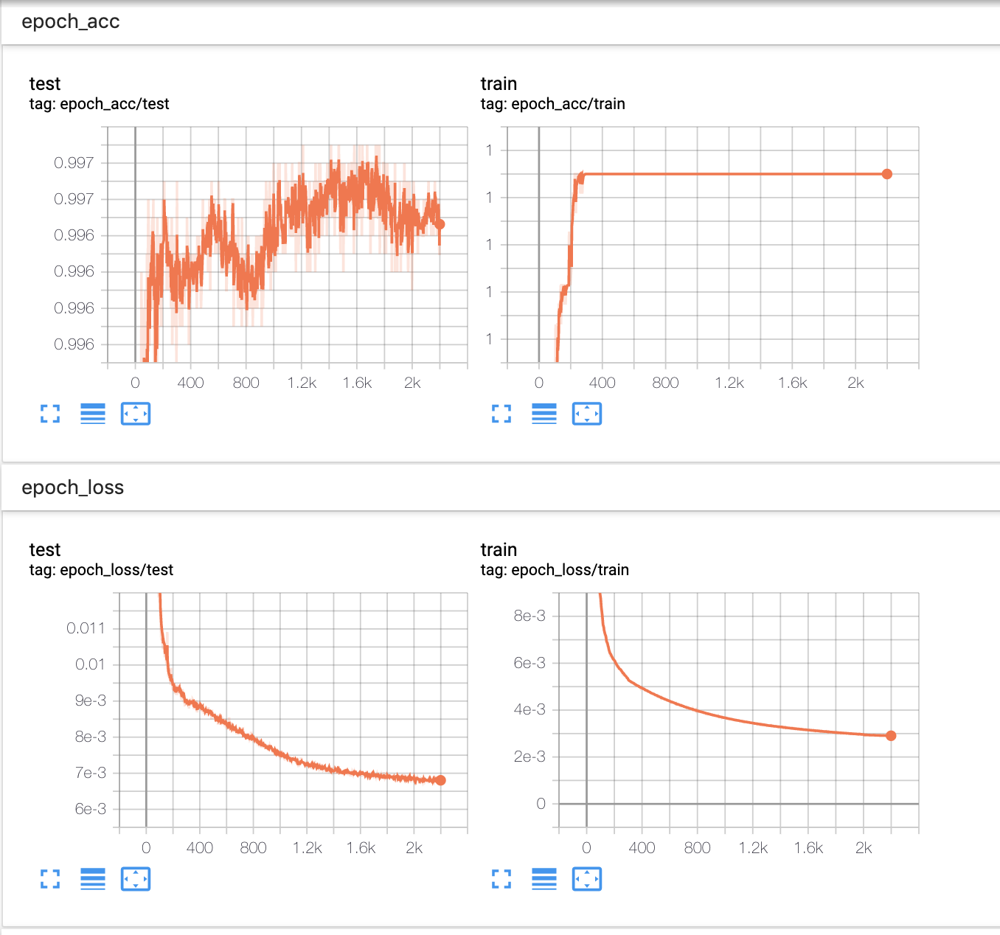
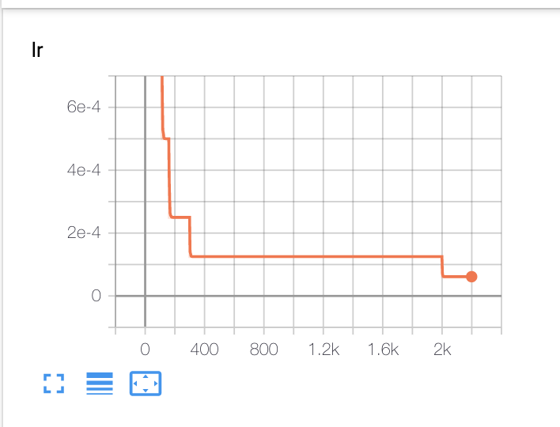
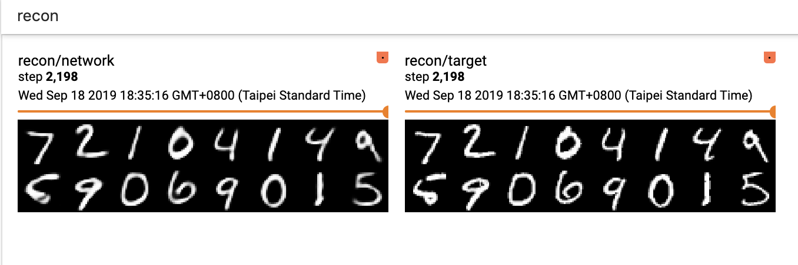
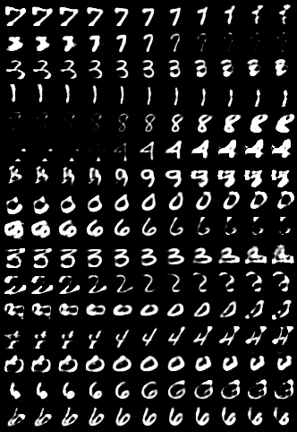

# DynamicRoutingBetweenCapsules-PyTorch
PyTorch Implementation of Dynamic Routing Between Capsules: https://arxiv.org/pdf/1710.09829.pdf

## Requirements and Installation
### Requirments
* PyTorch >= 1.2 (For PyTorch native tensorboard supports).
* Pyyaml
* tensorboard
* future

### Installation
The PyTorch is not included in `requirements.txt`. Please install through [official instruction](https://pytorch.org)
```
pip install -r requirments.txt
```

## Usage
### Train
#### Config
I use pyyaml for better configuration and logging experiments hyperparameters. Check at `cfg_sample.yaml` to see what you could config.

```yaml
num_epochs: 100                 # Number of Epochs to train
batch_size: 64                  # Batch Size
route_iters: 3                  # Routing Iterations for capsules module
use_cuda: True                  # If using CUDA support
loss: 
    with_reconstruction: True   # Use reconstruction loss of not
    rc_loss_weight: 0.0005      # Weight balance for classification margin loss and reconstruction mse loss
optim:
    lr: 0.001                   # Adam optimizer initial learning rate
    step_decay: 0.5             # Step decay for MultiStepLRScheduler
    milestone: [30, 70]         # Milestone for MultiStepLRScheduler
dataloader:
    num_workers: 4              # Data loader multiprocess workers 
    pin_memory: True            # Using CUDA pin mmemory
checkpoint:
    model_path: "capsnet.pt"    # Model state path to save, would be join we log_dir below
    log_dir: "checkpoint"       # Logger directory, including model state path and tensorboard event file
    use_checkpoint: True        # Using previous check point in log_dir for resuming training
    use_best: False             # Start training for best model in model state file
```
#### Command
```
python train.py CONFIG_FILE
```

### Play with capsules dimension
In the original paper, it perturbs the capsules dimension and reconstruct the digits. I provide a script `caps_perturb.py` for it.
The script load a random batch with 16 samples from test set of MNIST and perturb the dimensions. For the `nth` sample in the batch, it modified the `nth` capsules dimensions, respectively.

#### Command
```
python caps_perturb.py --model-path MODEL_STATE_FILE --output OUTPUT_PATH_FOR_IMAGE
```
#### Config
* `--model-path`: Model State File Path
* `--outpu`: Output Path for saving reconstruction images.


## Results

### Training

We achieve **99.71%** accuracy with the following setting. 

#### Config

* `Num Epochs`: 2200
* `Routing iterations`: 3
* `With Recostruction`: True
* `Batch Size`: 256

#### Optimizer settings

**Note that I used `MultiStepLRScheduler` instead of exponential decay in the original paper.** 

* `Initial Learning Rate`: 0.002
* `Step Decay Rate`: 0.5
* `Milestone (#Step to decay)`: [40, 100, 160, 300, 2000]


#### Loss Curve



#### Learning Rate


#### Reconscturciont


### Play with capsules dimension###

